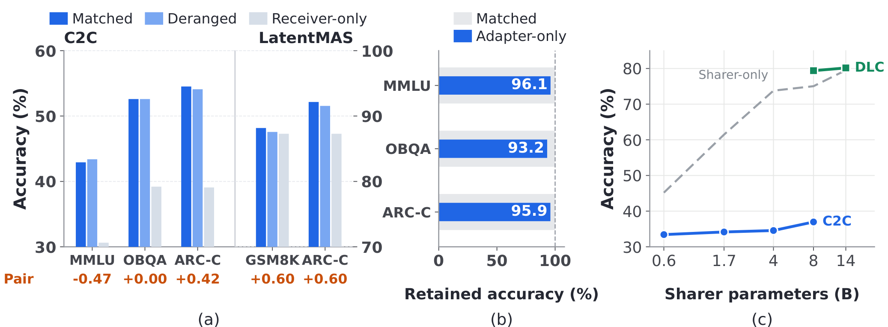
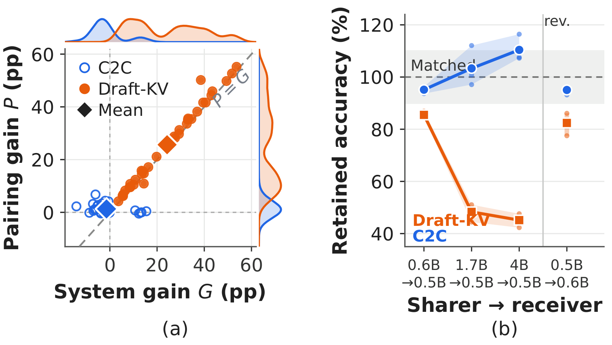
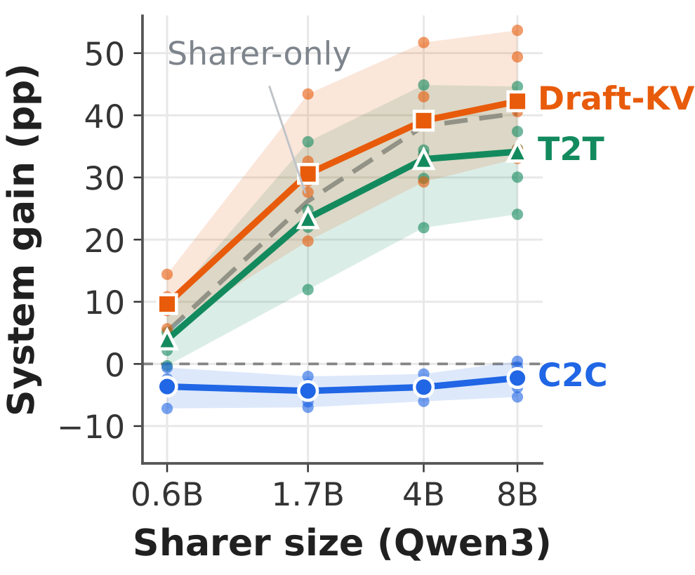

<div align="center">

<h1>Draft-KV: Learning Useful Latent Communication Between Language Models</h1>

**Linquan Wu**<sup>1</sup>, **Shichang Meng**<sup>1</sup>, **Tianxiang Jiang**<sup>2</sup>, **Haoyu Yang**<sup>3</sup>, **Peng Zhong**<sup>4</sup>,<br>
**Fengming Zhu**<sup>4</sup>, **Xi Peng**<sup>5</sup>, **Linqi Song**<sup>1</sup>, **Jacky Keung**<sup>1</sup>, **Jingyu Zhang**<sup>6</sup>

<sup>1</sup>City University of Hong Kong &nbsp;
<sup>2</sup>University of Science and Technology of China &nbsp;
<sup>3</sup>University of Electronic Science and Technology of China<br>
<sup>4</sup>AIPD, Tencent &nbsp;
<sup>5</sup>Theory Lab, Huawei &nbsp;
<sup>6</sup>Hong Kong Metropolitan University


<a href="LICENSE"></a>


</div>

<p align="center">
  
</p>

> **TL;DR.** A latent interface can raise a receiver's accuracy without using what the sharer sent. **Draft-KV** passes the key–value states a frozen sharer forms while *drafting an answer*, and trains only a **1.05M-parameter** gated bridge. The result is communication whose gains depend on the paired message and grow with sharer capability.

## News

- **[2026-09]** Training and evaluation code for Draft-KV is released.

## Contents

- [Highlights](#highlights)
- [Motivation: The Information-Use Gap](#motivation-the-information-use-gap)
- [Method](#method)
- [Main Results](#main-results)
- [Getting Started](#getting-started)
- [Reproducing the Paper](#reproducing-the-paper)
- [Roadmap](#roadmap)
- [Citation](#citation)

## Highlights

- **Diagnosis.** In existing latent interfaces, swapping each message for one generated for an unrelated question changes accuracy by **at most 0.60 pp**, while communication raises the receiver by up to **15.44 pp**.
- **Lightweight.** Both language models stay frozen. The bridge has **1.05M** trainable parameters, **348×** fewer than C2C and **36×** fewer than DLC.
- **Content-dependent.** The gain depends on the paired message in **all 35** Public settings. With a Qwen3-8B sharer, a frozen Qwen2.5-0.5B-Instruct receiver reaches **78.04%** on MMLU-Redux, versus **37.45%** alone and **36.40%** under a mismatched message.
- **Scales with the sharer.** From Qwen3-0.6B to Qwen3-8B, the mean system gain grows by **32.6 pp**, versus 30.2 pp for text-to-text and 1.4 pp for C2C. Draft-KV beats text-to-text in **33/35** Public and **14/14** Private settings.

## Motivation: The Information-Use Gap

Let $A_M$, $A_D$, and $A_R$ be receiver accuracy under a **Matched** message (produced for the current question), a **Deranged** message (produced for a different question), and **Receiver-only** (no communication). We separate

$$
G = A_M - A_R \quad (\text{system gain}), \qquad P = A_M - A_D \quad (\text{pairing gain}).
$$

$G$ credits the whole trained system. $P$ credits only the correctly paired content. When $G$ is large but $P \approx 0$, the gain comes from the trained interface, the sharer is dispensable, and a stronger sharer cannot help.

<p align="center">
  
</p>

<p align="center"><sub>
<b>The information-use gap.</b> (a) Replacing the paired message leaves accuracy almost unchanged for C2C and LatentMAS; the <i>Pair</i> row reports the pairing gain P. (b) A frozen C2C interface fed only mismatched messages still retains 93–96% of Matched accuracy. (c) On MMLU-Redux, stronger sharers barely improve C2C or DLC, even though sharer-only accuracy rises sharply.
</sub></p>

## Method

Draft-KV treats the sharer's draft as a *computation* to communicate, not as text to copy.

- **Message.** The frozen sharer drafts an answer to the current question. Only the key–value states at draft positions are sent; prompt positions are never transmitted.
- **Bridge.** Bias-free linear projections map the sharer's KV states into the receiver's KV-head layout at four communication layers. Only these projections and per-head gates are trained.
- **Reading.** The frozen receiver reads the packet as a separate side memory through a gated attention branch that reuses its own projections. Native self-attention and the causal cache are left intact. A zero gate recovers the receiver exactly.

The same bridge parameters pass through three progressive stages:

| Stage | Data | What the receiver learns | Updates |
|:--|:--|:--|--:|
| **1 · Reconstruction** | OpenHermes 2.5 | Recover the sharer's full assistant message from the packet, given only a fixed decoding instruction | 16,000 |
| **2 · Answer alignment** | OpenHermes 2.5 | Answer from the sharer's own draft, supervised on the reference answer | 4,000 |
| **3 · Task training** | ARC-Easy + ARC-Challenge (train/val) | Predict the gold answer under Matched packets while limiting harm from Deranged ones | 5,000 |

Stages 2 and 3 replay reconstruction every fifth update to keep the channel readable. The Stage 3 objective is

$$
\mathcal{L}_3 = \mathrm{NLL}(\text{Matched}) + \lambda \cdot \mathrm{ReLU}\Big(\mathrm{NLL}(\text{Deranged}) - \mathrm{sg}\big[\mathrm{NLL}(\text{Receiver-only})\big] - \tau\Big),
$$

with $\lambda = 0.1$ and $\tau = 0.1$ nats by default, where $\mathrm{sg}$ denotes stop-gradient. The guard is one-sided: it limits harm from a mismatched packet, but it never rewards making the negative control worse. More details are in [`docs/METHOD.md`](docs/METHOD.md), [`docs/THREE_STAGE_TRAINING.md`](docs/THREE_STAGE_TRAINING.md), and [`docs/STAGE3.md`](docs/STAGE3.md).

## Main Results

**Qwen3-8B → Qwen2.5-0.5B-Instruct.** Scores are in %. Public benchmarks (shared question) use option accuracy; Private benchmarks (evidence split between the two models) use exact match. Communication columns show **Matched / Deranged**. **Bold** marks the best score in each row and <ins>underline</ins> the second best.

| Benchmark | Protocol | Receiver | Sharer | Text-to-Text | C2C (M / D) | **Draft-KV (M / D)** |
|:--|:--:|--:|--:|--:|--:|--:|
| MMLU-Redux | Public | 37.45 | <ins>75.04</ins> | 72.05 | 36.97 / 36.45 | **78.04** / 36.40 |
| ARC-Easy | Public | 63.47 | <ins>97.56</ins> | 93.52 | 58.16 / 55.72 | **98.02** / 62.63 |
| ARC-Challenge | Public | 40.10 | <ins>92.83</ins> | 84.73 | 40.53 / 39.42 | **93.77** / 38.57 |
| OpenBookQA | Public | 43.40 | <ins>92.60</ins> | 80.80 | 41.20 / 39.00 | **92.80** / 43.00 |
| C-EVAL | Public | 41.75 | <ins>69.84</ins> | 65.82 | 37.96 / 36.03 | **74.81** / 39.67 |
| HotpotQA | Private | 32.28 | <ins>35.21</ins> | 34.59 | N/A | **42.48** / 15.05 |
| 2WikiMultihopQA | Private | 26.50 | <ins>37.60</ins> | <ins>37.60</ins> | N/A | **39.50** / 9.10 |

With matched messages, Draft-KV beats both models working alone. With deranged messages, it falls back to about Receiver-only on Public benchmarks, so the gain comes from the paired content.

<details>
<summary><b>Full results: 7 model pairs × 7 benchmarks</b> (click to expand)</summary>

<br>

| Sharer → Receiver | Benchmark | Protocol | Receiver | Sharer | Text-to-Text | C2C (M / D) | Draft-KV (M / D) |
|:--|:--|:--:|--:|--:|--:|--:|--:|
| **Qwen3-0.6B → Qwen2.5-0.5B-Instruct** | MMLU-Redux | Public | 37.45 | <ins>45.19</ins> | 42.56 | 33.43 / 33.40 | **46.11** / 36.59 |
|  | ARC-Easy | Public | 63.47 | <ins>69.15</ins> | 66.71 | 56.31 / 53.11 | **74.28** / 61.91 |
|  | ARC-Challenge | Public | 40.10 | <ins>51.71</ins> | 49.49 | 39.51 / 35.32 | **54.52** / 39.76 |
|  | OpenBookQA | Public | 43.40 | 44.60 | <ins>45.60</ins> | 41.00 / 40.00 | **52.00** / 41.20 |
|  | C-EVAL | Public | <ins>41.75</ins> | 41.38 | 41.46 | 37.74 / 36.11 | **47.40** / 40.56 |
|  | HotpotQA | Private | **32.28** | 11.93 | 13.20 | N/A | <ins>21.91</ins> / 14.47 |
|  | 2WikiMultihopQA | Private | **26.50** | 8.30 | 11.40 | N/A | <ins>17.50</ins> / 16.90 |
| **Qwen3-1.7B → Qwen2.5-0.5B-Instruct** | MMLU-Redux | Public | 37.45 | <ins>61.47</ins> | 60.19 | 34.16 / 32.69 | **65.07** / 36.84 |
|  | ARC-Easy | Public | 63.47 | <ins>89.52</ins> | 88.26 | 57.37 / 50.59 | **92.89** / 61.66 |
|  | ARC-Challenge | Public | 40.10 | <ins>79.44</ins> | 75.85 | 36.77 / 33.36 | **83.53** / 37.63 |
|  | OpenBookQA | Public | 43.40 | <ins>71.00</ins> | 65.40 | 41.40 / 37.00 | **76.00** / 42.40 |
|  | C-EVAL | Public | 41.75 | <ins>55.79</ins> | 53.71 | 34.77 / 34.18 | **61.52** / 40.42 |
|  | HotpotQA | Private | <ins>32.28</ins> | 21.18 | 22.68 | N/A | **35.04** / 12.37 |
|  | 2WikiMultihopQA | Private | **26.50** | 12.80 | 14.90 | N/A | <ins>19.10</ins> / 13.50 |
| **Qwen3-4B → Qwen2.5-0.5B-Instruct** | MMLU-Redux | Public | 37.45 | <ins>73.79</ins> | 71.15 | 34.57 / 34.34 | **75.98** / 25.80 |
|  | ARC-Easy | Public | 63.47 | <ins>96.42</ins> | 93.31 | 57.45 / 56.31 | **96.63** / 61.03 |
|  | ARC-Challenge | Public | 40.10 | **91.98** | 84.98 | 38.48 / 37.54 | <ins>91.81</ins> / 39.16 |
|  | OpenBookQA | Public | 43.40 | <ins>85.40</ins> | 77.80 | 39.60 / 40.00 | **86.40** / 42.00 |
|  | C-EVAL | Public | 41.75 | <ins>69.99</ins> | 63.67 | 37.44 / 36.40 | **71.03** / 41.31 |
|  | HotpotQA | Private | <ins>32.28</ins> | 29.04 | 28.57 | N/A | **40.34** / 14.76 |
|  | 2WikiMultihopQA | Private | 26.50 | 29.00 | <ins>29.50</ins> | N/A | **37.20** / 17.70 |
| **Qwen3-8B → Qwen2.5-0.5B-Instruct** | MMLU-Redux | Public | 37.45 | <ins>75.04</ins> | 72.05 | 36.97 / 36.45 | **78.04** / 36.40 |
|  | ARC-Easy | Public | 63.47 | <ins>97.56</ins> | 93.52 | 58.16 / 55.72 | **98.02** / 62.63 |
|  | ARC-Challenge | Public | 40.10 | <ins>92.83</ins> | 84.73 | 40.53 / 39.42 | **93.77** / 38.57 |
|  | OpenBookQA | Public | 43.40 | <ins>92.60</ins> | 80.80 | 41.20 / 39.00 | **92.80** / 43.00 |
|  | C-EVAL | Public | 41.75 | <ins>69.84</ins> | 65.82 | 37.96 / 36.03 | **74.81** / 39.67 |
|  | HotpotQA | Private | 32.28 | <ins>35.21</ins> | 34.59 | N/A | **42.48** / 15.05 |
|  | 2WikiMultihopQA | Private | 26.50 | <ins>37.60</ins> | <ins>37.60</ins> | N/A | **39.50** / 9.10 |
| **Llama-3.2-3B-Instruct → Qwen2.5-0.5B-Instruct** | MMLU-Redux | Public | 37.45 | <ins>64.44</ins> | 62.96 | 31.18 / 30.11 | **64.67** / 35.90 |
|  | ARC-Easy | Public | 63.47 | 88.68 | **89.44** | 49.28 / 47.01 | <ins>89.18</ins> / 63.13 |
|  | ARC-Challenge | Public | 40.10 | <ins>79.18</ins> | 75.34 | 33.53 / 32.42 | **79.61** / 37.97 |
|  | OpenBookQA | Public | 43.40 | <ins>79.40</ins> | 73.60 | 38.40 / 35.60 | **80.40** / 42.20 |
|  | C-EVAL | Public | 41.75 | <ins>43.24</ins> | 42.79 | 33.06 / 33.21 | **47.33** / 41.16 |
|  | HotpotQA | Private | **32.28** | 27.74 | 28.19 | N/A | <ins>28.54</ins> / 14.20 |
|  | 2WikiMultihopQA | Private | **26.50** | 22.20 | 22.00 | N/A | <ins>25.70</ins> / 17.00 |
| **Qwen2.5-0.5B-Instruct → Qwen3-0.6B** | MMLU-Redux | Public | 30.63 | 36.36 | 39.99 | <ins>42.92</ins> / 43.39 | **45.01** / 34.11 |
|  | ARC-Easy | Public | 59.51 | 54.42 | 56.94 | <ins>72.47</ins> / 72.56 | **73.02** / 58.46 |
|  | ARC-Challenge | Public | 39.08 | 39.76 | 50.26 | <ins>54.52</ins> / 54.10 | **55.38** / 38.23 |
|  | OpenBookQA | Public | 39.20 | 40.20 | 46.00 | <ins>52.60</ins> / 52.60 | **53.20** / 37.60 |
|  | C-EVAL | Public | 31.05 | 33.21 | 33.06 | **41.75** / 41.01 | <ins>41.16</ins> / 30.68 |
|  | HotpotQA | Private | 11.93 | **32.28** | 19.84 | N/A | <ins>31.65</ins> / 17.44 |
|  | 2WikiMultihopQA | Private | **28.00** | 10.00 | 14.50 | N/A | <ins>23.50</ins> / 24.40 |
| **Qwen3-8B → Qwen3-4B** | MMLU-Redux | Public | 71.64 | 75.04 | <ins>78.96</ins> | 71.00 / 70.70 | **79.94** / 70.44 |
|  | ARC-Easy | Public | 94.49 | 97.56 | **98.19** | 94.40 / 94.53 | <ins>98.11</ins> / 93.90 |
|  | ARC-Challenge | Public | 87.29 | <ins>92.83</ins> | 91.30 | 86.69 / 87.03 | **93.77** / 85.49 |
|  | OpenBookQA | Public | 78.80 | **92.60** | 88.40 | 78.60 / 78.20 | <ins>92.20</ins> / 76.40 |
|  | C-EVAL | Public | 70.43 | 69.84 | <ins>72.51</ins> | 67.76 / 67.90 | **75.78** / 69.47 |
|  | HotpotQA | Private | <ins>42.71</ins> | 35.21 | 41.72 | N/A | **45.12** / 37.88 |
|  | 2WikiMultihopQA | Private | 40.90 | 37.60 | <ins>44.10</ins> | N/A | **45.00** / 39.00 |

</details>

**Sharer scaling on MMLU-Redux** (receiver fixed to Qwen2.5-0.5B-Instruct, 37.45% alone):

| Sharer | Qwen3-0.6B | Qwen3-1.7B | Qwen3-4B | Qwen3-8B |
|:--|--:|--:|--:|--:|
| Sharer-only | 45.19 | 61.47 | 73.79 | 75.04 |
| Text-to-Text | 42.56 | 60.19 | 71.15 | 72.05 |
| C2C | 33.43 | 34.16 | 34.57 | 36.97 |
| **Draft-KV** | **46.11** | **65.07** | **75.98** | **78.04** |

<p align="center">
  
  &nbsp;
  
</p>

<p align="center"><sub>
<b>Left:</b> (a) Across the 35 Public settings, Draft-KV lies on the <i>P = G</i> diagonal, meaning its gain comes from the paired message, while C2C clusters near the origin. (b) Averaging the interface output over mismatched donors keeps C2C at 93–116% of Matched accuracy, but drops Draft-KV with 1.7B/4B sharers to 42–51%. <b>Right:</b> Draft-KV's mean system gain grows at every sharer size and tracks or exceeds the sharer-only reference.
</sub></p>

## Getting Started

### 1. Installation

```bash
git clone https://github.com/Svardfox/Draft-KV.git
cd Draft-KV

# Option A: the exact environment used for the paper
conda env create -f environment.yml
conda activate draft-kv
pip install -e .

# Option B: a minimal environment
conda create -n draft-kv python=3.10 -y
conda activate draft-kv
pip install -e ".[training,evaluation,dev]"
```

The launch scripts call the interpreter named by `DRAFT_KV_PYTHON`. Point it at the environment, then run the CPU test suite to check the installation:

```bash
export DRAFT_KV_PYTHON="$(which python)"
pytest test -q
```

> **Hardware.** All paper experiments ran on a single 96 GB GPU in bfloat16, with PyTorch 2.6.0, CUDA 12.4, and Transformers 4.52.4. Both language models stay frozen, so memory is dominated by the sharer. On smaller GPUs, pass `--train-microbatch-scale 2` (or `4`) to the multi-sharer launcher; this keeps the effective batch size unchanged.

### 2. Models and data

The scripts default to the following layout under `/workspace`. Every path can be overridden with command-line flags or `DRAFT_KV_*` environment variables. Alternatively, symlink your storage to `/workspace`.

```text
/workspace/
├── models/                          # Hugging Face checkpoints
│   ├── Qwen2.5-0.5B-Instruct/
│   ├── Qwen3-{0.6B,1.7B,4B,8B}/
│   └── Llama-3.2-3B-Instruct/
├── datasets/
│   ├── OpenHermes-2.5-500k/openhermes2_5_500k.json
│   ├── ai2_arc/  mmlu-redux-2.0/  openbookqa/  ceval/
└── draft-kv/                        # checkpoints, caches, logs, and results
```

```bash
# Models (download only the ones you need)
huggingface-cli download Qwen/Qwen2.5-0.5B-Instruct --local-dir /workspace/models/Qwen2.5-0.5B-Instruct
huggingface-cli download Qwen/Qwen3-8B             --local-dir /workspace/models/Qwen3-8B

# OpenHermes 2.5, first 500k conversations (Stages 1-2)
mkdir -p /workspace/datasets/OpenHermes-2.5-500k
python -c "from datasets import load_dataset; import json; \
ds = load_dataset('teknium/OpenHermes-2.5', split='train[:500000]'); \
json.dump(ds.to_list(), open('/workspace/datasets/OpenHermes-2.5-500k/openhermes2_5_500k.json', 'w'))"

# ARC (Stage 3 training) and MMLU-Redux (evaluation), normalized to JSONL
python script/dataset/download_downstream_mc.py --data-root /workspace/datasets
```

OpenBookQA and C-EVAL are read from `openbookqa/adapted/test.jsonl` and `ceval/adapted/val.jsonl`. The matching normalizers are in [`draft_kv/train/downstream_mc_data.py`](draft_kv/train/downstream_mc_data.py).

### 3. Training

A single command runs all three stages for one sharer–receiver pair:

```bash
# Qwen3-8B sharer -> Qwen2.5-0.5B-Instruct receiver
bash script/draft_kv/run_three_stage_training_multi_sharer.sh --sharer-model qwen3-8b --gpu-id 0

# Qwen3-8B sharer -> Qwen3-4B receiver
bash script/draft_kv/run_three_stage_training_multi_sharer.sh --sharer-model qwen3-8b --receiver-model qwen3-4b --gpu-id 0
```

Supported sharers are `qwen3-1.7b`, `qwen3-4b`, `qwen3-8b`, and `llama3.2-3b-instruct` (run `--help` for the full list). For any other pair, give explicit paths and a layer mapping (`Receiver-layer:Sharer-layer`, zero-based):

```bash
bash script/draft_kv/run_three_stage_training.sh \
  --sharer   /workspace/models/Qwen3-0.6B \
  --receiver /workspace/models/Qwen2.5-0.5B-Instruct \
  --layer-mapping 14:18,16:20,18:22,20:24 \
  --output-root /workspace/draft-kv/qwen3-0.6b_to_qwen2.5-0.5b \
  --gpu-id 0
```

Each stage writes to its own directory. Completed stages are reused when you rerun. To rerun only Stage 3 from an existing Stage 2 checkpoint, set `DRAFT_KV_STAGE3_INITIAL_STAGE2=/path/to/stage2_openhermes/train/last.pt` and run `bash script/draft_kv/run_stage3_train_and_eval.sh --gpu-id 0`.

### 4. Evaluation

Evaluate a Stage 3 checkpoint under the Receiver-only, Matched, and Deranged conditions. This also scores the standalone sharer:

```bash
DRAFT_KV_SHARER=/workspace/models/Qwen3-8B \
DRAFT_KV_RECEIVER=/workspace/models/Qwen2.5-0.5B-Instruct \
DRAFT_KV_CHECKPOINT=/path/to/stage3_mc/train/best.pt \
DRAFT_KV_DATASETS=mmlu-redux,arc-e,arc-c,openbookqa,ceval \
DRAFT_KV_GPU_ID=0 \
bash script/draft_kv/run_stage3_eval_all.sh
```

Set `SMOKE=1` to run a 20-example sanity check per benchmark. Each evaluator writes per-example records, a run manifest, and SHA-256 digests of its inputs.

## Reproducing the Paper

| Paper result | Entry point |
|:--|:--|
| Main results, Draft-KV Matched / Deranged | `run_three_stage_training_multi_sharer.sh`, then `run_stage3_eval_all.sh` |
| Sharer-only column | `eval_standalone_sharer.py` (run by `run_stage3_eval_all.sh` unless `DRAFT_KV_SKIP_STANDALONE=1`) |
| Sharer scaling | `run_stage3_multi_sharer.sh --sharers qwen3-1.7b,qwen3-4b,qwen3-8b`, then `summarize_stage3_multi_sharer.py` |
| Guard ablation (plain cross-entropy) | `run_stage3_train_and_eval.sh --protection-weight 0` |
| Stage 1 length ablation | `run_three_stage_training_multi_sharer.sh --stage1-pilot-updates 4000 --stage1-checkpoint-selection last` |

All scripts live in [`script/draft_kv/`](script/draft_kv/).

<details>
<summary><b>Repository structure</b></summary>

```text
draft_kv/
├── model/        # Draft-KV bridge, gated side-memory attention, depth-split execution
└── train/        # Datasets, collators, and stage-specific objectives
script/
├── dataset/      # Dataset download and normalization
└── draft_kv/     # Training and evaluation entry points
docs/             # Stage protocols and implementation notes
test/             # CPU integration and regression tests
assets/           # Figures used in this README
```

Model weights, datasets, checkpoints, and generated caches are not stored in this repository.

</details>

## Roadmap

- [x] Training and evaluation code
- [ ] Trained Draft-KV bridge checkpoints
- [ ] arXiv paper

## Citation

If you find Draft-KV useful, please cite:

```bibtex
@misc{wu2026draftkv,
  title  = {Draft-KV: Learning Useful Latent Communication Between Language Models},
  author = {Wu, Linguan and Meng, Shichang and Jiang, Tianxiang and Yang, Haoyu and
            Zhong, Peng and Zhu, Fengming and Peng, Xi and Song, Linqi and
            Keung, Jacky and Zhang, Jingyu},
  year   = {2026},
  note   = {Preprint}
}
```

## Acknowledgements

This codebase builds on [Cache-to-Cache (C2C)](https://github.com/thu-nics/C2C). We thank the authors of [C2C](https://arxiv.org/abs/2510.03215) and [LatentMAS](https://arxiv.org/abs/2511.20639) for releasing their code, and the Qwen, Llama, and OpenHermes teams for their open models and data.

## License

This project is released under the [Apache License 2.0](LICENSE).

For questions or problems, please [open an issue](https://github.com/Svardfox/Draft-KV/issues).
