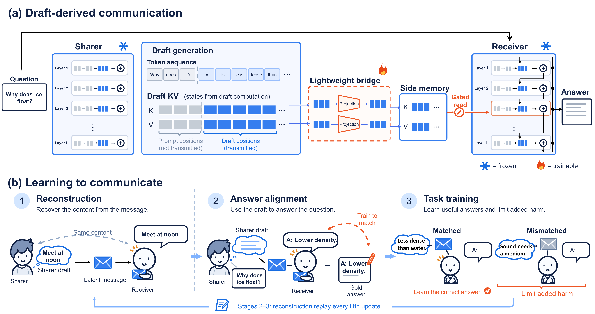

<div align="center">
  <h1>Draft-KV</h1>
  <h3>Learning Useful Latent Communication Between Language Models</h3>
</div>

Latent communication passes internal states between language models instead of
decoded text, but higher receiver accuracy alone does not prove that the
receiver used the transmitted content. Across five method-dataset pairs,
replacing a matched message with one generated for an unrelated question
changes accuracy by at most 0.60 points, even when communication improves the
receiver by 15.44 points. This **information-use gap** makes the learned
interface, rather than the Sharer, responsible for much of the gain.

**Draft-KV** instead communicates the key-value states formed while the Sharer
drafts an answer to the current question. Bias-free linear projections place
those states in a Receiver-native side memory, which a frozen Receiver reads
through a gated attention branch. Both language models remain frozen, and
progressive training moves from message reconstruction to answer supervision
under a one-sided guard against harm from mismatched messages.

- The interface trains **1.05M parameters**, 348x fewer than C2C, while both
  language models remain frozen.
- Draft-KV improves the Receiver in all **35 public settings**, with an average
  gain of **5.85 accuracy points**.
- With a Qwen3-8B Sharer, a frozen Qwen2.5-0.5B-Instruct Receiver reaches
  **78.04%** on MMLU-Redux, versus **37.45%** alone and **36.40%** under
  reassigned messages.
- Scaling the Sharer from 0.6B to 8B raises accuracy from **46.11%** to
  **78.04%** at a fixed interface size, and the gains transfer to held-out
  tasks.

## TODO

- [ ] Release trained Draft-KV bridge checkpoints.
- [ ] Release the arXiv paper.

<p align="center">
  
</p>

<p align="center">
  <sub><b>Figure 1: The information-use gap.</b>
  (a) Replacing the correctly paired message leaves accuracy essentially
  unchanged for both systems. (b) A frozen interface fed mismatched messages
  still retains 93-96% of Matched accuracy. (c) A stronger Sharer barely
  transfers its additional capability through existing interfaces.</sub>
</p>

<p align="center">
  
</p>

<p align="center">
  <sub><b>Figure 3: Draft-KV.</b>
  (a) The frozen Sharer drafts an answer, and the KV states formed over the
  prompt and draft are projected into the Receiver's layout. The frozen
  Receiver reads the resulting packet through a gated branch that reuses its
  own projections. (b) The same communication parameters pass through three
  progressive training stages.</sub>
</p>

## Method

Draft-KV treats the Sharer's draft as a computation to be communicated, not
merely as text to be copied. The transmitted packet contains only the
key-value states formed at draft positions; prompt positions remain hidden.
The Receiver reads this packet as a separate side memory, preserving its native
self-attention and causal cache.

Training proceeds in three stages:

1. **Reconstruction.** The Sharer teacher-forces a complete assistant message.
   The Receiver sees only a fixed decoding instruction and must reconstruct
   the message from the Draft-KV packet.
2. **Answer alignment.** The packet comes from the Sharer's own draft, while
   the Receiver is supervised on the reference answer. Reconstruction is
   replayed periodically to preserve readability.
3. **Task training.** On multiple-choice tasks, the Receiver learns from the
   full gold answer text under Matched and Deranged packets. A one-sided guard
   limits harm when the packet is mismatched without rewarding a deliberately
   worse negative control.

The Stage-3 objective is

```text
NLL(Matched)
+ lambda * relu(NLL(Deranged) - stopgrad(NLL(Receiver-only)) - tolerance)
```

with `lambda = 0.1` and `tolerance = 0.1` nats by default. Only the KV
projections and per-head gates are optimized.

## Quick Start

Create the environment and install the package:

```bash
conda env create -f environment.yml
conda activate task-aligned-draft-kv
python3 -m pip install -e .
```

Run the complete three-stage pipeline:

```bash
bash script/draft_kv/run_three_stage_training.sh --gpu-id 0
```

Run Stage 3 independently after Stage 2 has completed:

```bash
bash script/draft_kv/run_stage3_train_and_eval.sh --gpu-id 0
```

Individual stages remain available through `run_stage3_training.sh`,
`run_stage3_eval_all.sh`, and `run_stage3_eval.sh`.

## Repository Structure

```text
draft_kv/
  model/                 Core Draft-KV interface and depth-split execution
  train/                 Datasets, collators, and stage-specific objectives
script/
  dataset/               Dataset download and normalization utilities
  draft_kv/              Training and evaluation entry points
docs/                    Detailed stage protocols and implementation notes
test/                    CPU integration and regression tests
```

Model weights, datasets, checkpoints, and generated caches are intentionally
not stored in this repository.

## Detailed Documentation

- [Method](docs/METHOD.md)
- [Three-stage training](docs/THREE_STAGE_TRAINING.md)
- [Stage 3 protocol](docs/STAGE3.md)

## License

This project is released under the MIT License. See [LICENSE](LICENSE).
